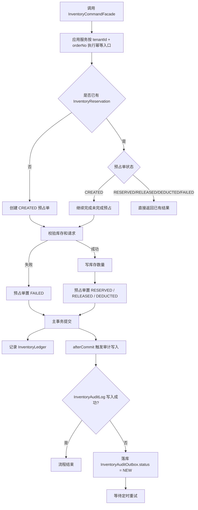
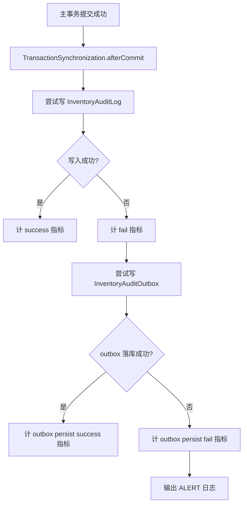
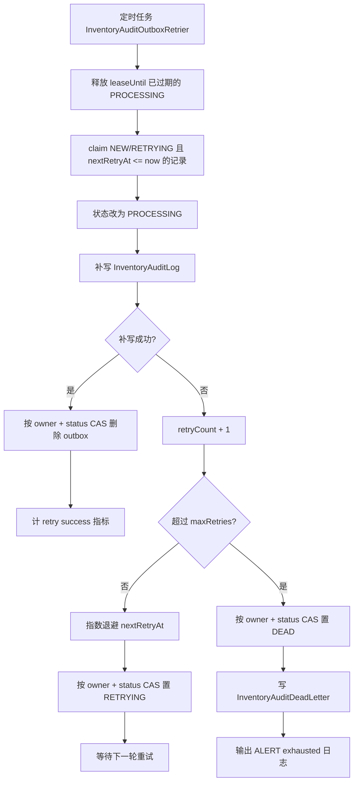
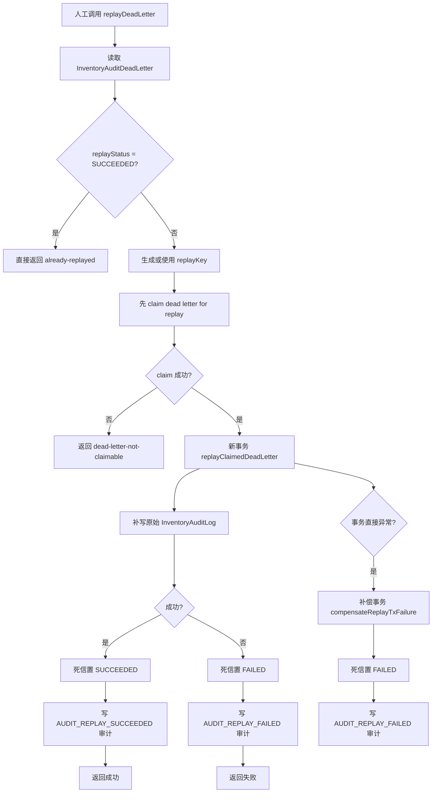
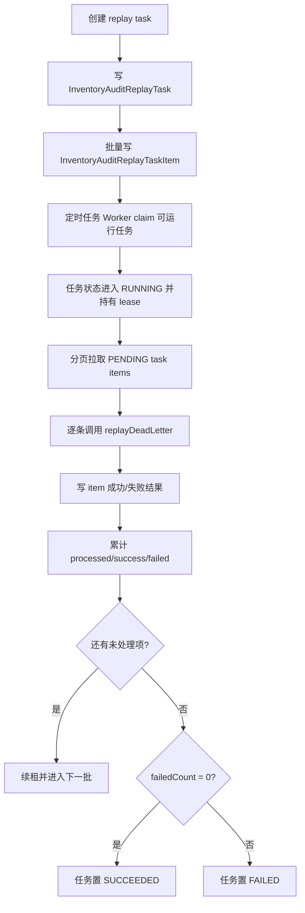
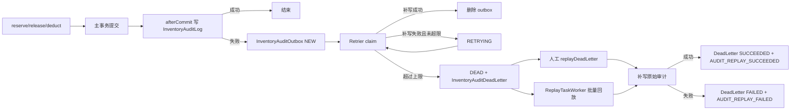

# Inventory Outbox Flow

## 1. Purpose

本文档面向研发、测试、运维，说明 `Inventory` 审计 outbox 的完整流程。  
本文档覆盖主业务命令幂等、审计延后写、outbox 重试、死信、人工重放、批量重放任务。  
本文档用于帮助人理解链路，不作为索引入口，不补充到 `docs/AGENT.md` 或其他文档索引。

## 2. Scope

当前范围：

- `reserveStock`
- `releaseReservedStock`
- `deductReservedStock`
- 审计日志延后写
- `InventoryAuditOutbox` 自动重试
- `InventoryAuditDeadLetter` 死信处理
- 单条人工重放
- 批量重放任务

不在当前范围：

- `Order` 域 outbox
- `Payment` 域回调幂等
- 通用消息队列语义

## 3. Core Objects

- `InventoryReservation`
- `InventoryLedger`
- `InventoryAuditLog`
- `InventoryAuditOutbox`
- `InventoryAuditDeadLetter`
- `InventoryAuditReplayTask`
- `InventoryAuditReplayTaskItem`

关键状态：

- `InventoryReservationStatus`: `CREATED`、`RESERVED`、`RELEASED`、`DEDUCTED`、`FAILED`
- `InventoryAuditOutboxStatus`: `NEW`、`PROCESSING`、`RETRYING`、`DEAD`
- `InventoryAuditReplayStatus`: `PENDING`、`RUNNING`、`SUCCEEDED`、`FAILED`
- `InventoryAuditReplayTaskStatus`: `PENDING`、`RUNNING`、`PAUSED`、`SUCCEEDED`、`FAILED`、`CANCELED`

## 4. Design Summary

`Inventory` 的 outbox 不是业务动作 outbox，而是审计补写 outbox。  
库存主业务事务先保证库存和预占单正确提交，审计日志在事务提交后 best effort 写入。  
如果审计写失败，失败事实落到 `InventoryAuditOutbox`，后续由定时补偿任务重试。  
重试耗尽后进入 `InventoryAuditDeadLetter`，再由人工或批量任务回放。  
回放的目标不是再次执行库存预占、释放、扣减，而是补写丢失的审计日志，并更新死信追踪状态。

## 5. Main Flow

## 6. Command Idempotency

### 6.1 Reserve

- 幂等键固定为 `tenantId + orderNo`
- 应用入口通过 `InventoryWriteRetrier` 包裹，冲突重试发生在事务外
- 若已存在预占单：
  - `CREATED`：继续补完
  - `RESERVED`：直接返回成功结果
  - `FAILED`：直接返回失败结果
  - `RELEASED`、`DEDUCTED`：直接返回已有终态结果
- `(tenantId, orderNo)` 唯一约束是最终兜底
- 创建预占单时若撞唯一键，回读已存在记录并直接收口为幂等返回

### 6.2 Release

- 幂等键固定为 `tenantId + orderNo`
- 若预占单不存在，返回失败结果，不修改库存
- 若预占单不是 `RESERVED`，直接返回当前状态，不重复回补库存
- 只有 `RESERVED -> RELEASED` 会真正执行库存回补和审计记录

### 6.3 Deduct

- 幂等键固定为 `tenantId + orderNo`
- 若预占单不存在，返回失败结果，不修改库存
- 若预占单不是 `RESERVED`，直接返回当前状态，不重复扣减库存
- 只有 `RESERVED -> DEDUCTED` 会真正执行库存扣减和审计记录

## 7. Audit Write And Outbox Fallback

固定点：

- `InventoryLedger` 在主链路内同步写入
- `InventoryAuditLog` 在事务提交后写入，不回滚主业务
- `InventoryAuditOutbox` 保存原始审计动作和失败原因
- outbox 初始状态固定为 `NEW`

## 8. Retry And Dead Letter Flow

固定点：

- 多实例消费前必须 claim，不能先查后处理
- claim 写入 `processingOwner`、`leaseUntil`、`claimedAt`
- 重试结果提交必须走 owner + 状态 CAS
- 退避策略是指数退避，受 `baseDelaySeconds`、`maxDelaySeconds` 限制
- 超过最大重试次数后，不再自动重试，只进入死信

## 9. Dead Letter Replay Flow

固定点：

- 回放对象是死信，不是 outbox
- 回放语义是补写审计，不是重新执行库存业务
- `replayKey` 是幂等追踪键，单条重放和批量任务都必须写
- 回放前先 claim 死信，避免人工和后台任务并发重复处理
- 事务失败后还有单独补偿事务兜底，保证失败痕迹可见

## 10. Replay Task Flow

任务规则：

- 任务本身只组织批量处理，单条语义仍复用 `replayDeadLetter`
- Worker 每轮都会续租，避免长任务被其他节点抢走
- item 逐条独立结算，单条失败不阻断整批推进
- 暂停任务时释放 `processingOwner` 和 `leaseUntil`
- 恢复任务时从 `PAUSED` 回到 `PENDING`

## 11. Full View

## 12. Operations Checklist

- 看不到审计日志时，先查 `bacon_inventory_audit_outbox`
- 若 outbox 长时间停在 `PROCESSING`，优先检查 `lease_until` 是否回收
- 若 outbox 已是 `DEAD`，转查 `bacon_inventory_audit_dead_letter`
- 人工重放前先确认失败原因是否仍存在
- 批量重放时重点看任务维度的 `processedCount`、`successCount`、`failedCount`
- 若出现大量 `AUDIT_REPLAY_FAILED`，优先检查审计表写入能力，而不是库存主业务

## 13. Open Items

无
