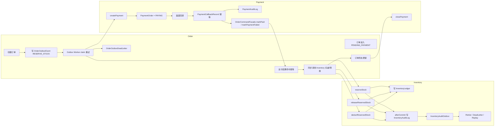
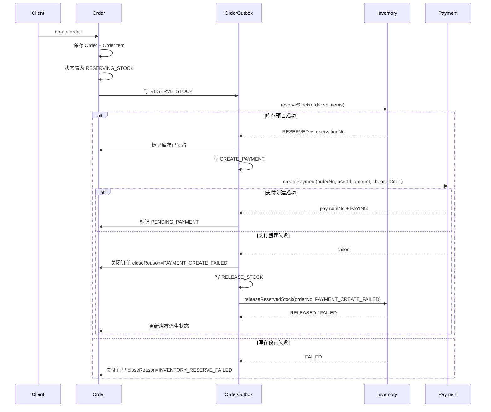
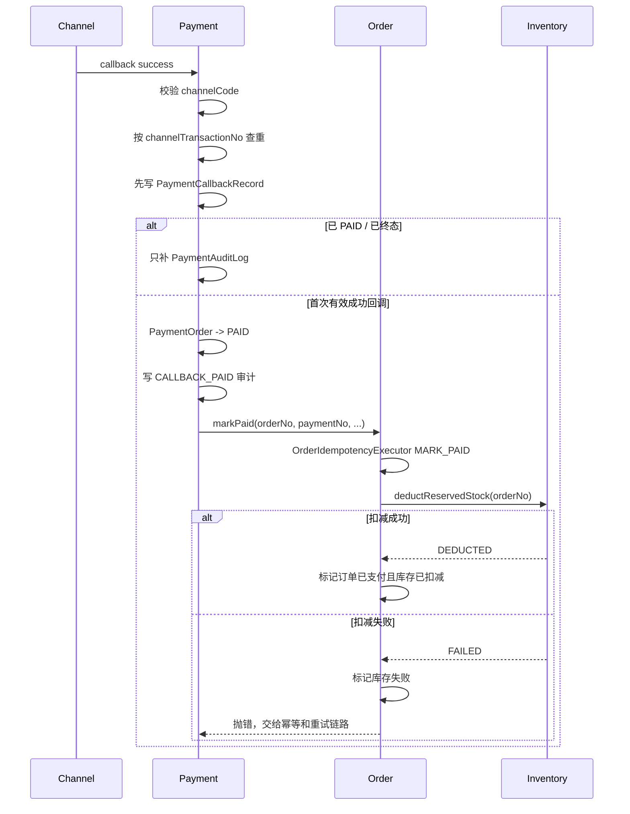
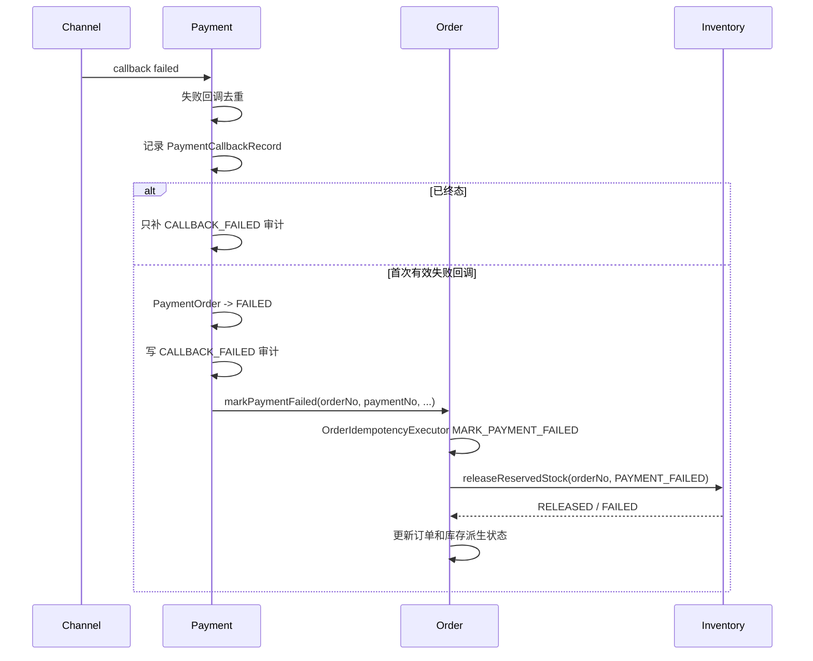
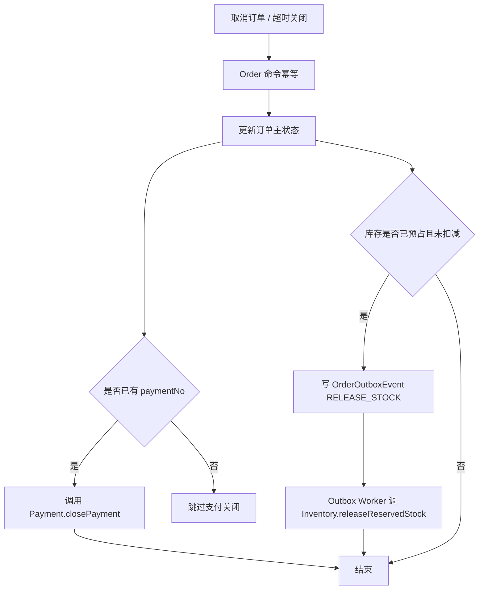
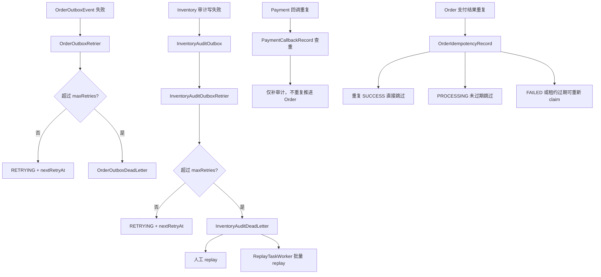

# Order Inventory Payment Flow

## 1. Purpose

本文档面向研发、测试、运维，说明 `Order`、`Inventory`、`Payment` 三个业务域的整合总流程。  
本文档重点覆盖下单、库存预占、支付创建、支付回调、库存释放/扣减，以及各域的幂等、outbox、补偿边界。  
本文档用于帮助人理解跨域链路，不作为索引入口，不补充到 `docs/AGENT.md` 或其他文档索引。

## 2. Scope

当前范围：

- `Order` 创建订单与 outbox saga
- `Inventory` 预占、释放、扣减与审计 outbox
- `Payment` 创建支付单、支付回调、关闭支付单
- 支付成功、支付失败、取消订单、超时关闭的跨域联动
- `Order` 命令幂等和 `Inventory` 审计补偿

不在当前范围：

- 发货履约
- 退款
- 采购入库
- MQ 中间件接入

## 3. Domain Roles

- `Order`
  - 负责订单主状态机
  - 负责跨域编排
  - 负责 `OrderOutboxEvent` 推进库存预占、支付创建、库存释放
  - 负责支付结果命令幂等

- `Inventory`
  - 负责库存主数据、预占、释放、扣减
  - 负责库存命令幂等
  - 负责库存审计日志与 `InventoryAuditOutbox`

- `Payment`
  - 负责支付单创建、关闭、渠道回调
  - 负责支付回调幂等
  - 通过 `OrderCommandFacade` 回传支付结果

## 4. Design Summary

三域协作分成两类链路：

- 主业务链路
  - `Order` 创建订单
  - `Order` 用 outbox 推进库存预占和支付创建
  - `Payment` 回调后再回推 `Order`
  - `Order` 再同步调用 `Inventory` 扣减或释放

- 可靠性链路
  - `Order` 用 `OrderOutboxEvent` 兜住跨域 saga
  - `Order` 用 `OrderIdempotencyRecord` 兜住支付结果、取消、超时关闭等重复命令
  - `Inventory` 用 `InventoryAuditOutbox` 兜住审计补写失败
  - `Payment` 通过 `PaymentCallbackRecord` 兜住回调幂等，不使用 outbox

## 5. Total View

## 6. Create Order Main Flow

固定点：

- `Order` 创建完成后先落单，再写 `OrderOutboxEvent`
- 库存预占和支付创建都不是控制器内联事务的一部分，而是 outbox saga 推进
- 只有库存预占成功后，`Order` 才会创建支付单
- 支付创建失败后，`Order` 会补发释放库存事件

## 7. Payment Callback Success Flow

固定点：

- `Payment` 先持久化 `PaymentCallbackRecord`，再更新 `PaymentOrder`
- `Payment` 不直接改订单表，只调 `OrderCommandFacade`
- `Order` 在 `markPaid` 里必须走命令幂等
- 支付成功后的库存扣减是硬前置条件，失败会抛错，不会静默吞掉

## 8. Payment Callback Failure Flow

固定点：

- 失败回调不允许覆盖 `PAID`
- `Order` 负责触发库存释放，不由 `Payment` 直接碰库存
- 释放结果只更新订单侧库存派生状态，不逆向重写支付域

## 9. Cancel And Timeout Flow

固定点：

- 取消、超时关闭都走 `OrderIdempotencyExecutor`
- `closePayment` 只用于取消和超时关闭，不用于支付失败或支付创建失败
- 库存释放由 `Order` 通过 outbox 或同步编排触发，仍由 `Inventory` 执行

## 10. Reliability Responsibilities By Domain

### 10.1 Order

- `OrderOutboxEvent`
  - 负责跨域 saga 的可靠推进
  - 事件类型固定为 `RESERVE_STOCK`、`CREATE_PAYMENT`、`RELEASE_STOCK`
  - 状态固定为 `NEW`、`RETRYING`、`PROCESSING`、`DEAD`
  - 使用 `businessKey + eventType` 做唯一幂等
  - 定时任务 claim + lease + CAS 提交
  - 超过重试上限进入 `OrderOutboxDeadLetter`

- `OrderIdempotencyRecord`
  - 负责 `markPaid`、`markPaymentFailed`、`cancel`、`closeExpired` 幂等
  - 状态为 `PROCESSING`、`SUCCESS`、`FAILED`
  - `PROCESSING` 记录 `processingOwner + leaseUntil`
  - 已成功命中直接跳过
  - 已失败或租约过期的 `PROCESSING` 可以重新 claim

### 10.2 Inventory

- 库存命令幂等按 `tenantId + orderNo`
- `reserve/release/deduct` 都由应用层重试器包裹
- 审计日志不是主事务强依赖
- `InventoryAuditOutbox`
  - 只负责审计补写，不负责库存业务动作
  - `afterCommit` 审计失败时写 `NEW`
  - 定时任务重试
  - 超限进入 `InventoryAuditDeadLetter`
  - 支持人工重放和批量任务重放

### 10.3 Payment

- `createPayment` 按 `orderNo` 幂等
- `closePayment` 按 `paymentNo` 幂等
- 成功回调按 `(channelCode, channelTransactionNo)` 幂等
- 失败回调按最近一次失败内容近似去重
- `Payment` 没有 outbox；其可靠性核心是：
  - 先落 `PaymentCallbackRecord`
  - 再更新 `PaymentOrder`
  - 再调用 `OrderCommandFacade`

## 11. Retry And Compensation Map

## 12. Operations Checklist

- 下单卡在 `RESERVING_STOCK` 时，先查 `bacon_order_outbox`
- 订单未进入 `PENDING_PAYMENT` 时，重点看 `RESERVE_STOCK` 和 `CREATE_PAYMENT` 两类 outbox
- 支付已成功但订单未完成时，先查 `PaymentCallbackRecord`，再查 `OrderIdempotencyRecord`
- 支付创建失败后库存没释放时，查 `OrderOutboxEvent.RELEASE_STOCK`
- 库存主业务成功但看不到审计日志时，查 `bacon_inventory_audit_outbox`
- `Order` 死信说明跨域 saga 没推进完
- `Inventory` 死信说明库存主业务已经结束，但审计补写没补上
- `Payment` 没有 outbox；回调重复或异常优先查 `PaymentCallbackRecord` 和 `PaymentAuditLog`

## 13. Open Items

无
