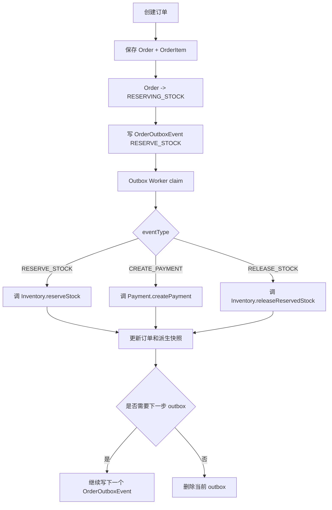
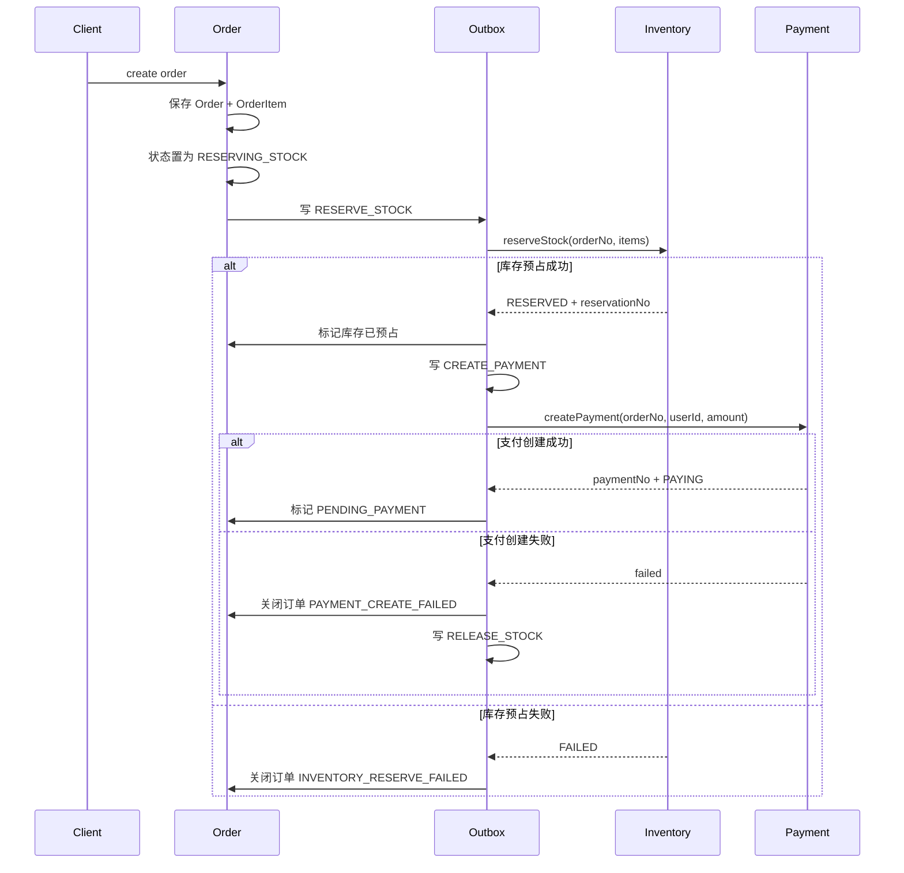
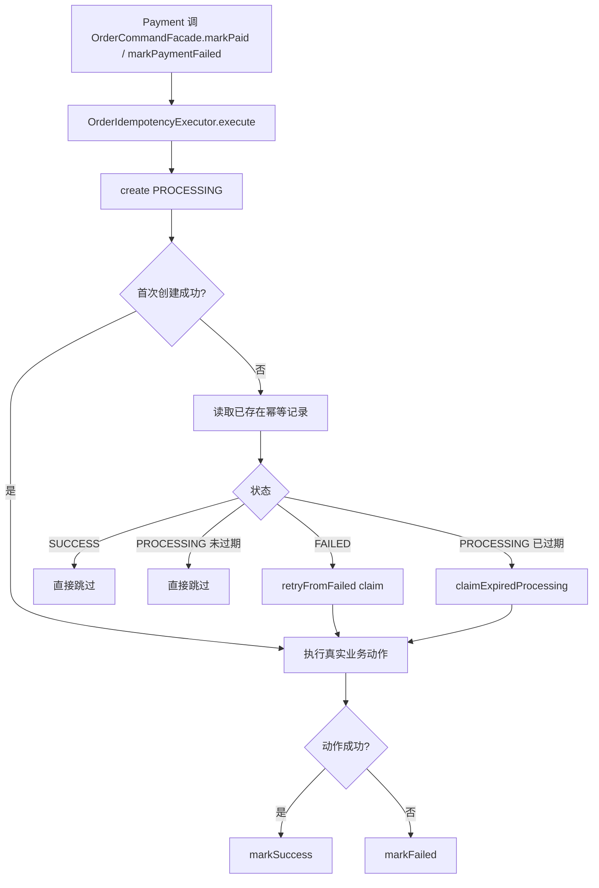
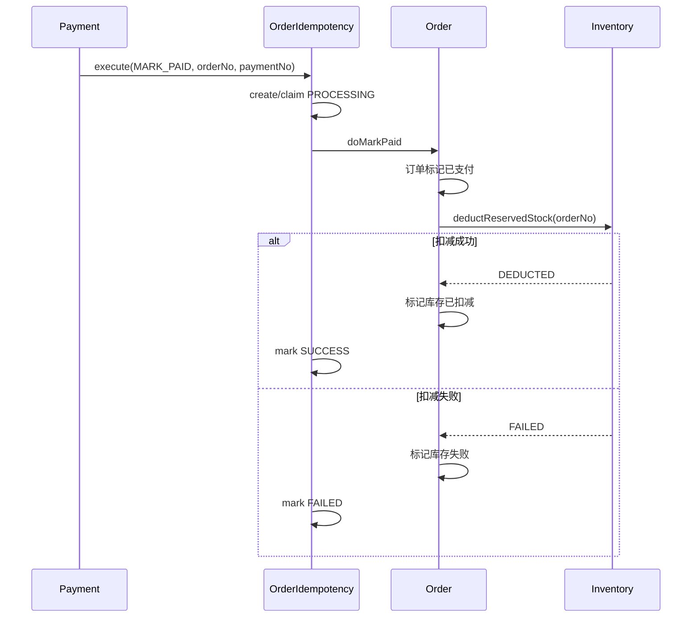
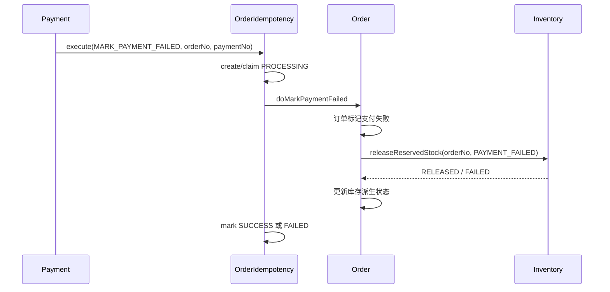
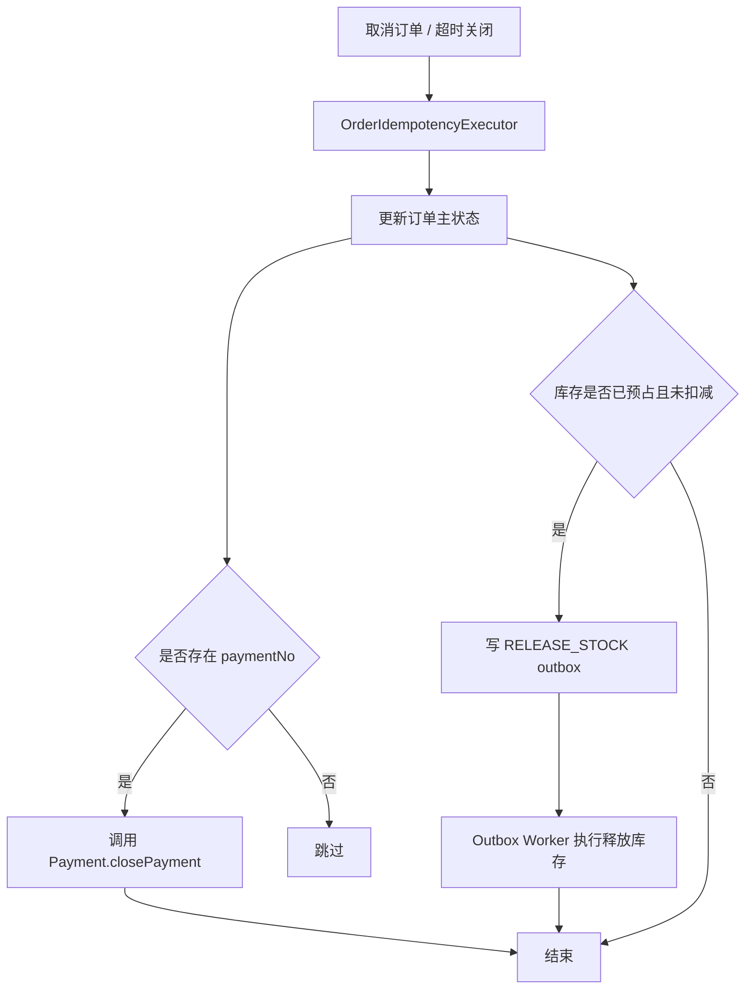
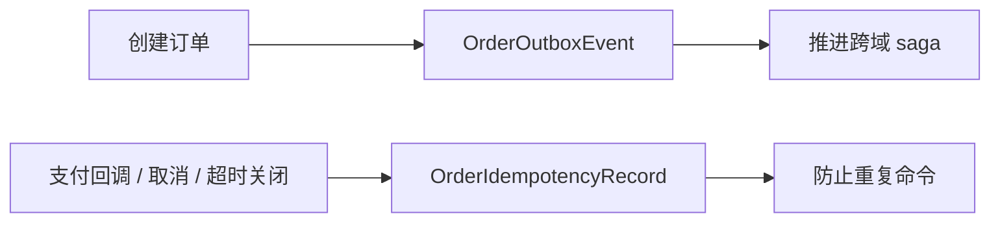

# Order Outbox Flow

## 1. Purpose

本文档面向研发、测试、运维，说明 `Order` 域 outbox 与命令幂等的完整流程。  
本文档覆盖创建订单后的 saga 推进、支付结果命令幂等、取消/超时关闭幂等、outbox 重试、死信边界。  
本文档用于帮助人理解 `Order` 单域可靠性设计，不作为索引入口，不补充到 `docs/AGENT.md` 或其他文档索引。

## 2. Scope

当前范围：

- 创建订单后 `OrderOutboxEvent` 的生成与推进
- `RESERVE_STOCK`、`CREATE_PAYMENT`、`RELEASE_STOCK` 三类 outbox 事件
- `OrderOutboxRetrier` 的 claim、lease、重试、死信
- `OrderIdempotencyRecord` 的命令幂等
- `markPaid`、`markPaymentFailed`
- 取消订单、超时关闭

不在当前范围：

- `InventoryAuditOutbox`
- `PaymentCallbackRecord`
- 发货履约
- 退款

## 3. Core Objects

- `Order`
- `OrderItem`
- `OrderOutboxEvent`
- `OrderOutboxDeadLetter`
- `OrderIdempotencyRecord`

关键状态：

- `OrderOutboxStatus`: `NEW`、`PROCESSING`、`RETRYING`、`DEAD`
- `OrderIdempotencyStatus`: `PROCESSING`、`SUCCESS`、`FAILED`

关键事件：

- `RESERVE_STOCK`
- `CREATE_PAYMENT`
- `RELEASE_STOCK`

## 4. Design Summary

`Order` 域有两套可靠性机制：

- `OrderOutboxEvent`
  - 负责创建订单后的跨域 saga 推进
  - 典型场景是库存预占、支付创建、库存释放

- `OrderIdempotencyRecord`
  - 负责支付结果、取消、超时关闭这些“外部可能重复到达”的命令幂等
  - 典型场景是 `markPaid`、`markPaymentFailed`、`cancel`、`closeExpired`

两者分工不同：

- outbox 解决“跨域动作如何可靠推进”
- idempotency 解决“同一命令如何避免重复执行”

## 5. Main Flow



## 6. Create Order And Saga Start



固定点：

- 创建订单后先保存主单和明细，再写 outbox
- `Order` 控制器返回成功不代表库存和支付已经完成
- saga 的第一步固定是 `RESERVE_STOCK`
- 只有库存预占成功，才会创建 `CREATE_PAYMENT`
- 支付创建失败时，订单会补发 `RELEASE_STOCK`

## 7. Outbox Event Types

### 7.1 `RESERVE_STOCK`

职责：

- 调用 `Inventory.reserveStock`
- 根据结果更新订单库存派生状态
- 预占成功后补写 `CREATE_PAYMENT`
- 预占失败后关闭订单

### 7.2 `CREATE_PAYMENT`

职责：

- 调用 `Payment.createPayment`
- 成功时把订单推进到 `PENDING_PAYMENT`
- 失败时关闭订单
- 支付创建失败后补写 `RELEASE_STOCK`

### 7.3 `RELEASE_STOCK`

职责：

- 调用 `Inventory.releaseReservedStock`
- 只更新订单侧库存派生状态
- 不再反向改订单主状态机

## 8. Outbox Retry And Dead Letter Flow

```mermaid
flowchart TD
    A[OrderOutboxRetrier 定时任务] --> B[释放过期 lease 的 PROCESSING]
    B --> C[claim NEW/RETRYING 且 nextRetryAt <= now]
    C --> D[状态置为 PROCESSING]
    D --> E[executeClaimed(event)]
    E --> F{执行成功?}
    F -- 是 --> G[deleteClaimed]
    F -- 否 --> H[retryCount + 1]
    H --> I{超过 maxRetries?}
    I -- 否 --> J[指数退避 nextRetryAt]
    J --> K[markRetryingClaimed]
    K --> L[等待下一轮]
    I -- 是 --> M[markDeadClaimed]
    M --> N[写 OrderOutboxDeadLetter]
    N --> O[输出 ALERT exhausted]
```

固定点：

- 消费前必须 claim，不能先查后处理
- claim 写入 `processingOwner`、`leaseUntil`、`claimedAt`
- 删除和状态回写都要带 owner 条件
- 重试采用指数退避
- 超过上限进入 `OrderOutboxDeadLetter`

## 9. Payment Result Idempotency Flow



固定点：

- 幂等键核心是 `orderNo + eventType`
- `paymentNo` 用于上层事件语义，不落入 `OrderIdempotencyRecordKey`
- 幂等链路只保护命令动作，不负责 saga 事件推进
- `PROCESSING` 必须带租约，避免节点崩溃后永久卡死

## 10. Mark Paid Detailed Flow



固定点：

- `markPaid` 的真正业务动作包括订单支付成功和库存扣减
- 库存扣减失败时不会把幂等记录标成成功
- 后续重复命中时，只有 `SUCCESS` 才会静默跳过

## 11. Mark Payment Failed Detailed Flow



固定点：

- 支付失败回写的主目标是回收库存
- 释放库存的失败同样会让幂等记录进入 `FAILED`

## 12. Cancel And Close Expired



固定点：

- 取消和超时关闭也走命令幂等，不允许重复关单或重复释放
- 支付关闭和库存释放不是同一个动作
- 支付关闭可同步执行，库存释放仍通过 `RELEASE_STOCK` outbox 推进

## 13. Relationship Between Outbox And Idempotency



边界说明：

- outbox 面向“后续步骤”
- idempotency 面向“重复命令”
- 一个订单可以同时存在 saga outbox 和命令幂等记录
- 它们不是互相替代关系

## 14. Operations Checklist

- 订单卡在 `RESERVING_STOCK` 时，先查 `RESERVE_STOCK` outbox
- 库存已预占但没有支付单时，查 `CREATE_PAYMENT` outbox
- 支付创建失败但库存未释放时，查 `RELEASE_STOCK` outbox
- `PROCESSING` 长时间不动时，优先看 lease 是否过期
- `OrderOutboxDeadLetter` 表示 saga 没推进完
- `OrderIdempotencyRecord.FAILED` 表示命令动作执行失败，可被后续重试 claim
- 若支付重复回调但订单没推进，先看 `OrderIdempotencyRecord`，再看库存调用失败原因

## 15. Open Items

无
