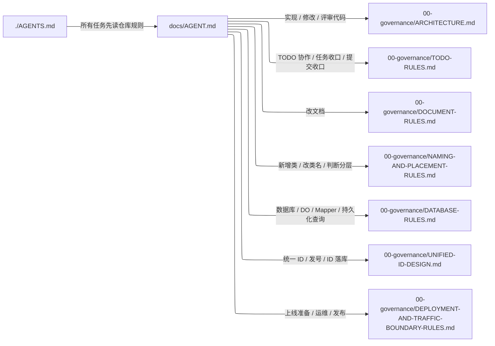
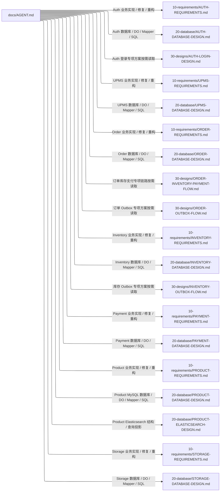
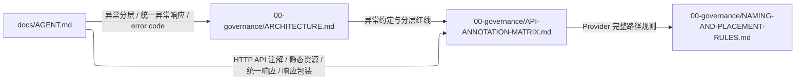
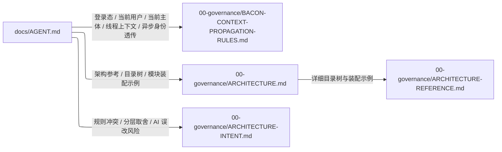
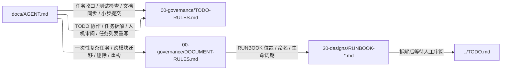

# DOCUMENT ROUTING MAP

## 1. Purpose

本文档用图表达 Bacon 文档加载路径，帮助人类检查和优化文档路由。

本文档是 human 文档，不是 AI 默认加载入口。AI 执行任务时仍以 [`../../AGENTS.md`](../../AGENTS.md)、[`../AGENT.md`](../AGENT.md) 和具体文档内的直接链接为准。

本文档只用于回答这些问题：

- 某类任务从入口会读到哪些文档。
- 某条文档依赖链是否清晰。
- 某个文档是否缺少上游加载路径。
- `docs/AGENT.md` 是否存在漏路由、重复路由或过度路由。

## 2. Scope

当前覆盖关键文档加载路径：

- 仓库入口。
- `docs/AGENT.md` 任务路由。
- 治理文档入口。
- 需求文档、数据库设计文档和专项设计文档的典型路径。
- API、异常、上下文和架构参考路径。
- TODO / RUNBOOK 协作路径。

当前不覆盖范围：

- 不作为全量文档索引。
- 不替代 `docs/AGENT.md`。
- 不要求 AI 在普通任务中读取本文档。
- 不记录每个文件的完整出入边。

## 3. Reading Rule

真实加载规则固定在两处：

1. `docs/AGENT.md`：任务类型到文档的路由规则。
2. 具体文档内部链接：当前文档到直接依赖文档的下一级链接。

本文档中的连线只表达“人类理解上的加载条件”。当本文档和真实加载规则不一致时，必须修改真实加载规则或本文档，使二者重新一致。

## 4. Entry Map

## 5. Business Route Map

## 6. API And Error Route Map

## 7. Context And Architecture Reference Route Map

## 8. TODO And RUNBOOK Route Map

## 9. Maintenance Checklist

新增或调整稳定文档路由时，人类维护者检查以下问题：

- 这个文档是否需要进入 `docs/AGENT.md` 的任务路由。
- 这个文档是否只需要被上游文档直接链接。
- 这条路由的加载条件是否足够明确。
- 是否存在另一个文档已经表达同一规则。
- 是否会让 AI 在普通任务中多读无关文档。
- 本文档的图是否需要同步调整。
- 对应生成提示词 `docs/50-prompts/DOCUMENT-ROUTING-MAP-PROMPT.md` 是否需要同步调整。

## 10. Open Items

无
